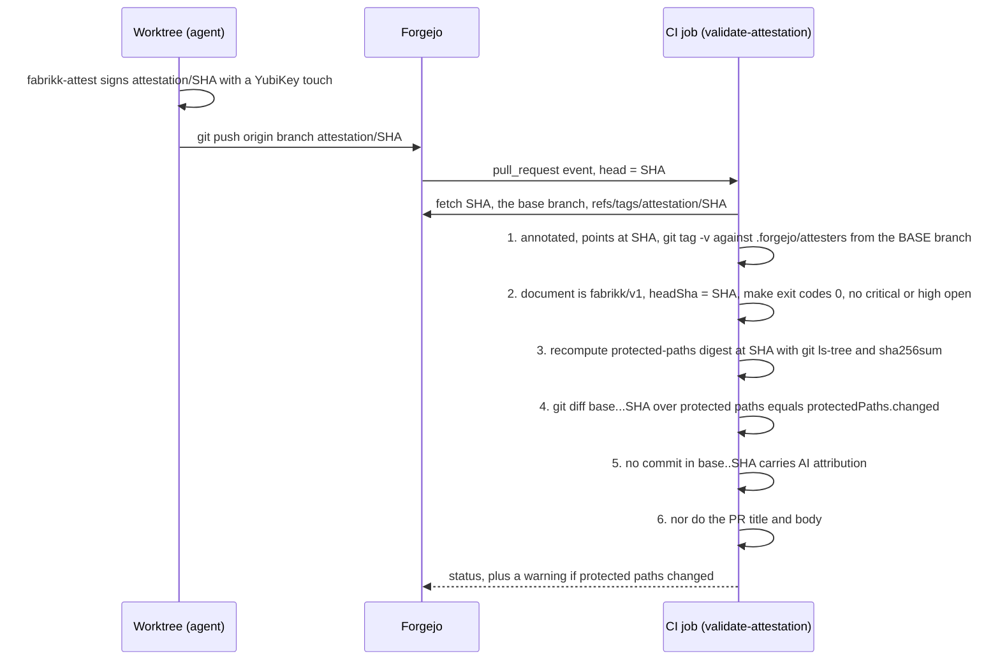

# Attestation and trust

The attestation is how the loop's result reaches the forge without CI re-running the loop. It is a signed, annotated
git tag, `attestation/<headSha>`, on the exact commit that was verified and reviewed. CI checks the tag on every push
to a pull request. If the tag is missing, wrong, or unsigned, the check fails.

## What the tag carries

The tag message is a subject line and a JSON document (`attestation: fabrikk/v1`, schema in
`extensions/models/attestation.ts`):

| Field | Says |
|---|---|
| `workItem`, `branch`, `headSha`, `attestedAt` | What was attested, and when |
| `verification.check`, `verification.verify` | Exit code and duration of `make check` and `make verify` at headSha |
| `planApproval` | Who approved the plan, in which cycle |
| `codeReview.unresolved` | Count of unresolved findings per severity in the last review |
| `protectedPaths.paths`, `.sha256`, `.fileCount` | The protected paths and a content digest of them at headSha |
| `protectedPaths.changed` | Which protected files the branch changed against the merge base |

`fabrikk-attest` refuses to sign unless every input concerns headSha: the `make` runs, the review, the approval,
and the digest must all be for that commit, the worktree must be clean and on the branch, and the tag must end up
pointing at headSha with a signature. Nothing is committed for it, so the verified commit, the attested commit, and
the PR head are one commit.

## What CI checks

`.forgejo/workflows/validate-attestation.yaml` runs on every pull request push, in bash, with no LLM and no swamp:

1. **Signature.** The tag is annotated, points at the PR head, and `git tag -v` verifies it against the allowed signers
   in `.forgejo/attesters`. That file is read from the base branch, so a pull request cannot add its own attester.
   Forgejo's tag protection for `attestation/*` allows the same people to push such tags; keep the two lists equal.
2. **Document.** Version `fabrikk/v1`, `headSha` equals the PR head, both `make` runs exited 0, and no critical or high
   finding is unresolved. A tag that honestly records a failed loop does not pass.
3. **Digest.** The protected-paths digest is recomputed with the shell recipe in `extensions/models/git_paths_digest.ts`
   and must equal the recorded one. The recipe and the TypeScript compute the same value by construction.
4. **Change list.** `git diff --name-only <base>...<head> -- <protected paths>` must equal the recorded list. A non-empty
   list passes the check but emits a warning and a job summary: this PR needs a human on protected paths, whatever
   else is green.
5. **Commit messages.** No commit in `<base>..<head>` carries AI attribution: a `Co-Authored-By` naming an agent or
   model, or a "generated with" footer. The pattern is the one in `extensions/models/source_standards.ts`, copied
   literally; `fabrikk-verify` already refused such a branch at preflight, so this catches only what was pushed around it.
6. **PR text.** The title and body from the event carry none either. They reach the script through the environment,
   never interpolated into it. On the workbench, the `source-standards` model refuses the text before `pr_ensure`
   sends it.

## Protected paths

Protected paths are the files that steer every agent or produce the release. Changing them needs a human in Forgejo
regardless of who authored the change. The list lives in three places that must agree: the source-standards skill
(the rule), the `paths` default of `workflows/workflow-fabrikk-attest.yaml` (what gets digested), and Forgejo's
branch protection (the enforcement, once `validate-attestation` is a required check).

`.agents/`, `.claude/`, `agent-constraints/`, `AGENTS.md`, `CLAUDE.md`, `models/` (the factory definition and model instances),
`workflows/`, `extensions/`, `tools/`, `docs/decisions/`, `docs/schema.yaml`, `Makefile`, `compose.yaml`, `deploy/dev/`, `.forgejo/`, `cosign.pub`.

`Makefile`, `tools/`, `compose.yaml`, and `deploy/dev/` are protected because verification runs them from the branch
under review: a weakened `make check` or a weakened check binary would still yield a green attestation. `.forgejo/` builds and signs releases and
validates attestations; `cosign.pub` decides which release signatures verify.

## What this does and does not prove

- The signature proves **who attested** and that the document has not changed since.
- The document proves **what the factory recorded**: which runs, review, and approval it saw for that commit. CI cannot
  read swamp's run data, so it trusts the attester's summary of it. Sharing fabrikk's swamp store (a remote datastore or
  `swamp serve`) would let CI check the records themselves; the tag would stay as the anchor in git.
- Forgejo runs the **PR head's copy of the workflow**, so a pull request that edits `.forgejo/` can weaken the check
  for itself. `.forgejo/` is protected: check 4 reports the change, and a human reviews it. Swamp adds an LLM
  review-integrity check on such trust-root changes; fabrikk does not have one yet.
- The check is not yet required on `main`. After its first run on a real pull request, make it required with
  `branch_protection_ensure` ([guides/operate-the-forge.md](../guides/operate-the-forge.md)).
