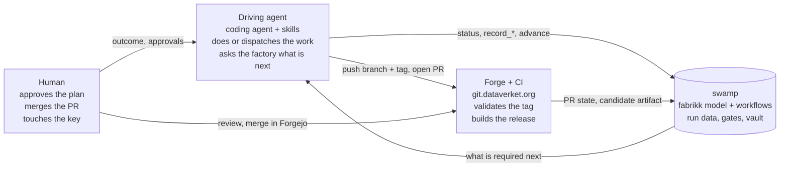
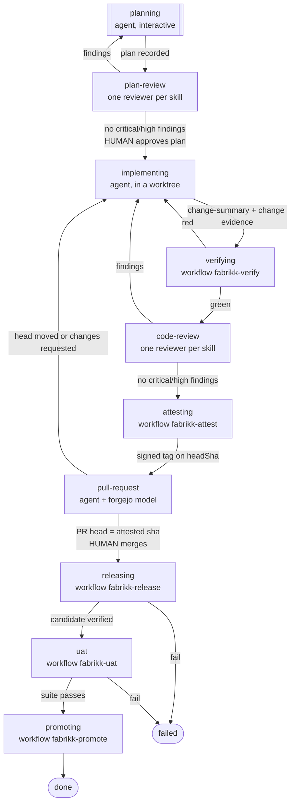
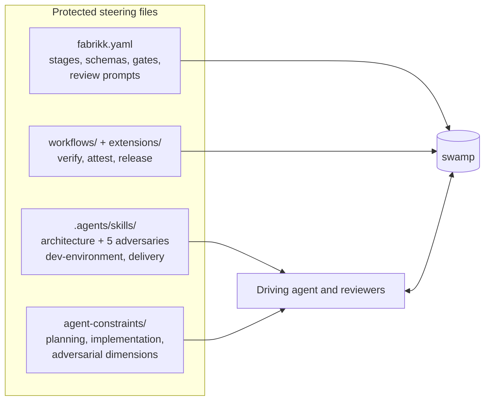

# How fabrikk works

fabrikk is a software factory: a state machine that takes a work item (an outcome someone wants) through planning,
adversarial review, implementation, verification, code review, attestation, a pull request, a release, and user
acceptance testing, and records every step as data. It is built on [swamp](https://github.com/swamp-club/swamp), and it
follows one idea: **the factory is a program; skills are its context.** The process lives in a swamp model and a few
swamp workflows. The skills and constraint files say what good looks like. An agent drives the loop, but the agent
never decides what the next step is. It asks the factory.

## The actors

Four things act, and each has a boundary it cannot cross.



- **The human** writes the outcome, approves the plan, and merges the pull request. Those are the only two approvals in
  the loop. Their YubiKey signs every commit and the attestation tag, so nothing gets signed without a touch.
- **The driving agent** is a session of any enrolled coding tool (Claude Code or Codex today, `.swamp.yaml` lists
  them) with the `software-factory` skill and the fabrikk skills loaded. It
  executes whatever the current stage's `work` block says: do it itself (`interactive`), spawn one reviewer per skill
  (`dispatch`), or trigger a swamp workflow (`workflow`). It records what it produced through the model and asks again.
- **swamp** holds the factory definition, runs the workflows, validates every artifact against its schema, evaluates the
  gates, and keeps all of it as versioned data in `.swamp/`. Secrets come from the `fabrikk` vault at run time.
- **The forge and CI** are Forgejo at `git.dataverket.org` and its Actions runners. CI never runs the loop; it validates
  the attestation on every pull request push and builds the release candidate after merge.

## The loop

The factory definition is `models/@swamp/software-factory/fabrikk.yaml`. Rendered as a graph it looks like this
(`swamp model method run fabrikk describe` prints the exact one):



Every arrow is a *transition* with *gates*. A gate is a fact the factory can check: an artifact exists, a workflow
succeeded, findings are clear, a CEL expression holds, a human approved. The agent cannot advance until every gate on a
transition passes, and the factory tells it which gate is blocking and why. Each stage also has a cycle limit (five,
ten for `implementing`); a stage that keeps looping parks for the human.

Two approvals are human and nowhere else: `plan-approval` at `plan-review` and `merge-approval` at `pull-request`.
The agent never satisfies those on its own.

## What each stage does, and where

| Stage | Who | What happens | Code |
|---|---|---|---|
| `planning` | agent | Turns the outcome into a plan with the sections `planning-conventions.md` requires; recorded as the `plan` artifact, validated against its schema. | `agent-constraints/planning-conventions.md`, `.agents/skills/*` |
| `plan-review` | one subagent per skill | Attacks the plan along `adversarial-dimensions.md`; findings recorded as `plan-review`. Critical or high findings send it back. Then the human approves. | `agent-constraints/adversarial-dimensions.md`, the `systemPrompt` in the definition |
| `implementing` | agent | Implements the plan in a worktree, tier 0 green, commits signed. Records `change-summary` (files, LOC, ADRs) and `change` evidence (worktree, branch, headSha). | `agent-constraints/implementation-conventions.md` |
| `verifying` | swamp workflow | In that worktree, refuses a dirty tree, a moved HEAD, or a commit message carrying AI attribution, then `make check` (tier 0) and `make verify` (tier 2). Results are pinned to headSha. No LLM. | `workflows/workflow-fabrikk-verify.yaml`, `extensions/models/dev_environment.ts`, `extensions/models/git_commit_messages.ts`, `extensions/models/source_standards.ts`, `Makefile` |
| `code-review` | one subagent per skill | Reviews the diff at headSha against the plan and every adversary; compares actual LOC with the estimate; the previous round's findings are fed forward. | the `systemPrompt` in the definition, `agent-constraints/adversarial-dimensions.md` |
| `attesting` | swamp workflow | Digests the protected paths, lists which the branch changed, checks that verification, review, and approval all concern headSha, and signs the annotated tag `attestation/<headSha>`. | `workflows/workflow-fabrikk-attest.yaml`, `extensions/models/attestation.ts`, `extensions/models/git_paths_digest.ts` |
| `pull-request` | agent + human | Pushes branch and tag, opens the PR through the `forgejo` model, records the PR head from the API. The human reviews and merges in Forgejo; the merge commit is read back from the API. | `models/@thomas/forgejo/forgejo.yaml`, `extensions/models/forgejo_actions.ts`, `.forgejo/workflows/validate-attestation.yaml` |
| `releasing` | CI, then swamp workflow | CI builds the candidate on merge (`make release`). The workflow waits for it and verifies signature, provenance, `release.json`, digest-pinned images, and the `candidate` tag. Never builds. | `.forgejo/workflows/release.yaml`, `Makefile`, `workflows/workflow-fabrikk-release.yaml`, `extensions/models/release_artifact.ts` |
| `uat` | swamp workflow | Black-box suite against the deployed candidate. Not built yet: needs a UAT cluster. | (`fabrikk-uat`, to come) |
| `promoting` | swamp workflow | Retags the UAT-passed digest from `candidate` to `current`. Not built yet. | (`fabrikk-promote`, to come) |

The full path list is in [reference/code-map.md](../reference/code-map.md); the stage contracts (artifact and evidence
schemas, gates, record names) are in [reference/factory-definition.md](../reference/factory-definition.md).

## Where the steering comes from

The agent's judgment is shaped by files in the repository, and every one of them is a protected path: changing them
needs a human in Forgejo, and the attestation carries a checksum of them.



- Skills live in `.agents/skills/`, symlinked into `.claude/skills/`, so every enrolled agent loads them by name,
  and `AGENTS.md` (imported by `CLAUDE.md`) carries the repository rules once. Stage `work` blocks list which
  skills apply. The architecture skill is used everywhere: one pattern, its vocabulary, and small Go examples from an
  unrelated domain (bike rental) so the agent copies the shape and not the domain. Each adversary is used twice, on the
  plan and on the code.
- `agent-constraints/` are the `constraints` file of a stage: what a plan must contain, how to implement, what to attack.
- The definition's `systemPrompt` blocks are the review prompts. They bind run data (`${{ data.latest(...) }}`), so a
  reviewer is told the branch and commit it reviews and fetches the rest itself.

## The loop boundary

The program reaches two things outside the workbench: the forge, through the `forgejo` model with a repository-scoped
token, and the registry, anonymously with `cosign.pub`. It reaches nothing fabrikk-infra deploys and holds no
credential for any of it: no kube context, no fleet key, no registry push credential exists in this repository.
Models for operating that infrastructure (the cluster, the Talos fleet through Omni, the registry's push side, the
release runner, forge-wide settings) live in fabrikk-infra's own swamp, with their own vault, and are used by a human
from that checkout.

**Why.** A workbench runs an agent, and the boundary bounds what an agent that goes wrong can reach: a pull request,
and a read of the registry. The mirror rule already holds on the other side, where the UAT environment holds no git
credential. The boundary is structural rather than checked: `models/` and `workflows/` are protected paths, so an
instance that would cross it is a change a human sees in Forgejo. Two consequences for the stages not built yet:
`uat` learns the applied revision from the environment's health endpoint or the registry, never from Flux, and
`promoting` retags in the registry from CI, where that credential already is.

## State is data

Nothing about a run lives in the agent's conversation. Every record is swamp data under the `fabrikk` model,
namespaced by work item: `artifact-<workItem>-plan`, `evidence-<workItem>-change`,
`approval-<workItem>-plan-approval`, `status-<workItem>`, and so on. A new session picks up where the last one
stopped by asking:

```sh
swamp model method run fabrikk status --input workItem=<ref>
swamp data query 'modelName == "fabrikk" && name == "status-<ref>"' \
  --select 'attributes.transitions.filter(t, !t.satisfied).map(t, {"transition": t.name, "blockedBy": t.gates.filter(g, !g.pass).map(g, g.reasons)})' --json
```

The first refreshes the status record; the second reads why the run is blocked. The workflows leave their own records
too (`dev-env-<sha>`, `git-<sha>`, `attest-<sha>`, `release-<sha>`), always keyed by the commit they are about, so a
result can never be mistaken for another commit's. [reference/cli.md](../reference/cli.md) lists the commands.

## Your role

The talk fabrikk is built on puts it in three lines: define the outcomes, engineer the factory, and when the outcomes
are bad, improve the factory. A work item is an outcome ("tenants can onboard and publish their first event, isolated
from each other"), not an implementation; if it names an implementation, planning rewrites the outcome first. You
talk about outcomes and architecture; the factory handles implementation. When what comes out is wrong, the fix is
in a skill, a constraint, a gate, or a workflow, not in the code by hand, and the factory runs again.

## Why this shape

- **Trust comes from the program, not from skills.** Skills are context; a frontier model follows them most of the
  time, which is not good enough for "did the tests run" or "was the plan approved". Those are gates, workflows, and
  signed records. A skill never describes a process; the definition does. See the split in
  [docs/README.md](../README.md#program-skills-docs).
- **CI validates, it does not execute.** The loop runs where the agent, the code, and the session stack are on one
  machine (dev-environment skill: never split one loop across a network). CI checks the record of that loop, the
  signed tag, and it builds the release, which a workbench must never do. Swamp's own factory works the same way.
- **Data over memory.** Reviewers get no shared context with the implementer and fetch what they review from run data.
  The pull-request stage copies shas from the forge's API. An agent that "remembers" a sha is the failure mode.
- **Humans approve records.** The plan the human approves is the recorded artifact; the merge is done in Forgejo. The
  agent presents payloads fetched fresh, never summaries.
- **Everything after the merge is about a digest.** The release artifact's digest is the release identity; UAT and
  promotion take it and nothing else. See [release-model.md](release-model.md).
