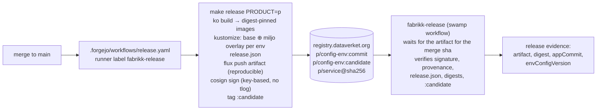
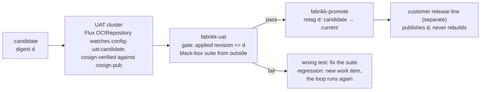

# Release model

Git is where releases are authored. The registry is where they travel. The candidate is built once, by CI on shared
infrastructure, after the merge. UAT tests that digest and promotion retags it. Nothing after UAT rebuilds, and a
workbench never builds what ships. The delivery skill (`skills/delivery/SKILL.md`) is the rule; this page is the
mechanism.

## From merge to candidate

- **L1 and L2.** Each product keeps its environment-agnostic manifests in `<product>/deploy/base/` (L1, next to the
  code). Environment overlays live in the separate `miljo` repository, `environments/<env>/<product>/` (L2, owned by
  the environment line). `make release` joins them: it renders the base with ko-built images pinned by digest, then
  renders every overlay whose kustomization lists `../base`.
- **One artifact per environment.** The rendered manifests and a `release.json` (`product`, `environment`,
  `app_commit`, `env_config_version`, `images`) are pushed as a Flux OCI artifact to
  `<registry>/<product>/config-<env>:<commit>`, reproducibly: the same commit and the same `miljo` version give the
  same digest, so a re-run cannot move a release. The artifact is signed with cosign, key-based, no public transparency
  log, and tagged `candidate`.
- **The digest is the release identity.** `fabrikk-release` records it as `release` evidence. UAT and promotion take
  that evidence and nothing else.

`.forgejo/workflows/release.yaml` runs on push to `main` when a product, `go.work`, the `Makefile`, or the workflow
itself changes, on a runner labelled `fabrikk-release`, with `REGISTRY_USERNAME` and `REGISTRY_PASSWORD` as Actions
secrets. The Makefile pins ko, cosign, kustomize, crane, and flux by version (`make tools`, into `_tools/bin`).

## After the candidate

Neither `fabrikk-uat` nor `fabrikk-promote` exists yet: UAT has to run end to end against a real environment, and there
is none. A factory run today stops at `uat`. Rollback is retagging the previous digest.

## The signing key

The cosign private key must never be on disk on the runner: not in Actions secrets, not on a volume. The design is a
release runner (a second forgejo-runner deployment in `fabrikk-infra`, label `fabrikk-release`, a Kata VM pod in
`dataverket-prod`) whose key is seeded from an attester's laptop over FIDO SSH into memory, and gone on restart.
Recommended use is an OpenBao transit engine with in-memory storage so a job signs without reading the key; the
fallback is a memory volume mounted read-only into the job.

This is not built. `release.yaml` today reads `COSIGN_PRIVATE_KEY` from Actions secrets, which contradicts the
design; the README's follow-up list tracks the decision. Whichever is chosen, `cosign.pub` is committed at the
repository root and is a protected path.

## What is deliberately not here

Ring or wave promotion and the fleet ledger; the L2 tunable-field linter; SBOMs; signatures on individual images; a
mirrored, digest-pinned base image per product; releases triggered by `miljo` changes. Every environment is tagged
`candidate` until the customer release line exists.
