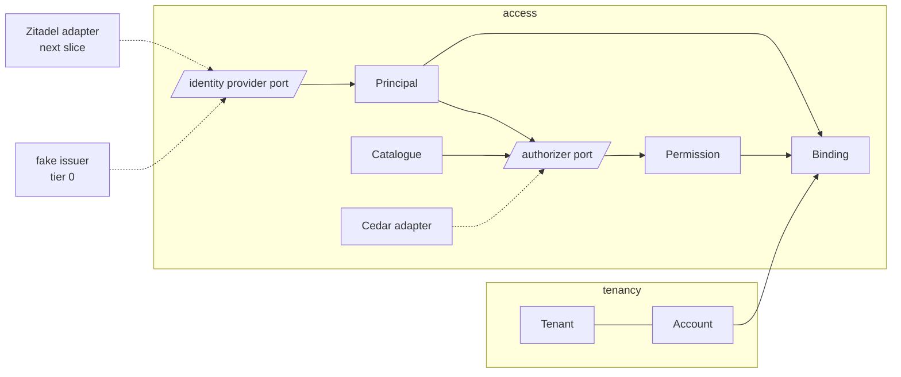

# Sentral

Sentral is the control plane: the product a tenant talks to, and the one that decides who may do what across the
other products. This page is its ubiquitous language and its context map. The architecture skill supplies the pattern
words (value object, aggregate, port); this page supplies Sentral's own nouns. Subjects, CloudEvent types, Cedar
entities, and Go identifiers use these words and no others; a new word is a change to this page first.

Every decision this page rests on is fabrikk's own, in [`decisions/`](../decisions/README.md): the service names
(0001), tenancy and accounts (0002), subjects and the envelope (0003), the identity-provider port (0006). Earlier
systems (ferga, the PoC) are read as evidence that a shape works or hurts, never as decisions.

## Language

| Term | Meaning | Where it appears |
|---|---|---|
| Tenant | A customer organisation. One NATS account, one identity-provider organisation. The isolation boundary the product promises. | account name, the `tenant` CloudEvents extension, Cedar principal attribute |
| Principal | Who is acting, with a tenant and grants. Identity-provider-neutral. A machine principal is one whose Sentral grant carries the role `service`, a fact the identity provider records and the tenant admin assigns; nothing the client sends decides it. | the identity-provider port's output, Cedar principal |
| Grant | A principal's roles on one service, as the identity provider records it. | Cedar principal attribute |
| Service | A Dataverket product a tenant can be granted. The closed set of names is [decision 0001](../decisions/0001-service-naming.md); the lower-cased name is the subject's first segment ([decision 0003](../decisions/0003-subjects-and-cloudevents-envelope.md)). | subject first segment, identity-provider project, Cedar resource attribute |
| Account | A NATS account: a tenant account or a service account. The hard wall; subjects never cross it except by an explicit export and import. The accounts a callout may bind to are an explicit allow-list; anything else is refused by construction. | callout binding, topology |
| Binding | The callout's act of placing a connection in an account with a set of permissions. | callout, the isolation tests |
| Permission | A subject pattern a principal may publish to or subscribe to, plus the right to answer requests. Every principal may subscribe to its own inbox prefix and nothing else of the inbox space; only the service role may subscribe to request and command subjects, so no principal can read another's token or replies. | Cedar decision, NATS user claims |
| Policy | The rules that turn a principal and a subject into permissions. Behind the `Authorizer` port; Cedar is the adapter. | `sentral/internal/access/adapters/cedar/*.cedar` |
| Catalogue | The subject patterns policy decides over: `<service>.qry.>`, `<service>.cmd.>`, `<service>.evt.>`, and the connection's own inbox prefix. Policy cannot enumerate subjects; the catalogue is what it is asked about. | callout |
| Subject | A NATS subject inside an account, service first: `<service>.<kind>.<aggregate>.<verb>`, kind `cmd`, `evt`, or `qry`. | [decision 0003](../decisions/0003-subjects-and-cloudevents-envelope.md) |
| Command | A CloudEvent that instructs, imperative, carrying its authority in the `authorization` extension, never in `data`. | `no.dataverket.<context>.<aggregate>.<verb>` |
| Event | A CloudEvent that states a fact, past tense. | `no.dataverket.<context>.<aggregate>.<verb-ed>` |
| Request | A command that needs an answer now: a NATS service request whose reply is a CloudEvent. Reads only; never a disguised event pair. | subjects with kind `qry` |
| Reply | The answer to a request: a CloudEvent typed as the past tense of the request verb, with its own id minted by the replier and the request's traceparent, carried only on the requester's inbox, never published on a subject. Not a domain event. | `no.dataverket.<context>.<aggregate>.<verb-ed>` on the inbox |
| Intent | A command addressed to a worker, carrying its own short-lived, audience-scoped token. Later slice. | Maskin, Nett |
| Worker | A Dataverket process adjacent to the infrastructure it manages, reached over a local socket, holding no network credential to that infrastructure and acting only on signed intents (security skill, the on-node pattern). Never *agent*: in fabrikk that word means the driving agent, the session that runs the factory. | Maskin, Nett, Objekt |
| Identity provider | The downstream port Identitet fills: verify a token, return a principal. Zitadel is the first adapter; a fake is the first implementation. | port, fake, contract suite |

## Bounded contexts

| Context | Owns | State today |
|---|---|---|
| `access` | principal, grant, binding, permission, policy, catalogue; the auth callout and the identity-provider port | the first slice |
| `tenancy` | tenant, account, topology (which accounts exist and what they export and import) | declared, no package yet: Tenant and Account are value objects in `access/domain` until an aggregate exists |

Dependencies point one way: `access` reads from `tenancy` (which account a tenant is) and never the reverse. The
callout is the one service with no pinned tenant: it serves every tenant, lives in its own account, and its only
output is a binding. Every other service pins its tenant at startup.

## The first probe

The first slice proves the path with a greeting: a human principal's CLI connects with a token, the callout binds it to
its tenant account with the permissions policy allows, the CLI sends the request `no.dataverket.access.greeting.say`
on `sentral.qry.greeting.say`, Sentral's handler verifies the envelope and the tenant claim and replies with
`no.dataverket.access.greeting.said` on the CLI's inbox, and the CLI prints it together with the request id, its
client name, and the traceparent it sent, never its token.
Greeting is a probe inside `access`, not a context and not an aggregate; it exists to make the isolation trio testable
and is removed when a real aggregate replaces it.

## Why these words

- *Principal* rather than *user*: machines act too, and the identity provider's word for a person must not leak past
  the port.
- *Binding* rather than *login*: the callout does not authenticate, the identity provider did; it decides where a
  verified principal may stand and what it may say.
- *Catalogue* is a word the code needs and policy languages lack: an authorization engine answers questions, it does
  not list answers.
- *Service* rather than *project*: *project* is the identity provider's word for the same thing and belongs behind the
  port.
- *Worker* rather than *agent*: *agent* was an earlier system's word for these processes, and in fabrikk it already
  names the session that drives the factory; one word for two actors is how a security rule gets misread.
- *Request* is named because the architecture skill forbids faking it with an event pair; a probe that wants an answer
  is a request, and the first real aggregate is what proves the command-to-event path.
